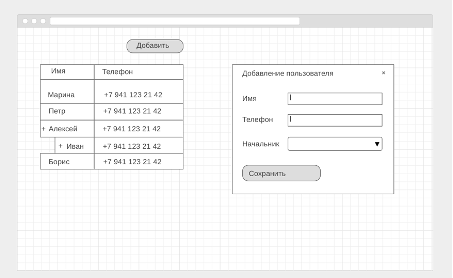

# Roistat Frontend Developer Test

## Выполнил: Владимир Тельнов
Контакты:
* GitHub: https://github.com/vvtelnov
* Phone: +7(961)943-92-94
* Telegram: vv@Telnov
* e-mail: vvtelnov@mail.ru

## Дублирую текст задания

### Советы по выполнению ТЗ
* 1.	Перед выполнением рекомендуем прочитать наш code conv. Первые 3 раздела применимы к любому языку и платформе.
* 2.	Используйте технологию flexbox для верстки. Это может упростить верстку всех компонентов в этом задании.
* 3.	При выполнении ТЗ запрещено использовать UI-kit’ы c уже готовыми компонентами. 
* 4.	Интерфейс должен быть понятным и отзывчивым.

Задачи перечислены в порядке приоритета. Желательно выполнить их все, но если вы ограничены во времени, постарайтесь соблюсти баланс между количеством выполненных задач и их качеством. Для нас важнее получить качественный интерфейс и код с продуманной разбивкой компонентов.

На изображении представлен мокап интерфейса. Стилизацию интерфейса оставляем на ваше усмотрение.

### Само ТЗ:
* 1.	Создайте таблицу и кнопку, вызывающую модальное окно с формой.
* 2.	Сохраняйте данные из формы в таблицу. Данные должны сохраняться в LocalStorage при обновлении страницы.
* 3.	Добавьте в форму select с выбором родителя (любого из уже сохранённых пользователей).  
* 4.	Добавьте в таблицу поддержку вложенных уровней. Глубина вложенности должна быть неограниченной, то есть родителем может быть любой существующий пользователь.
* 5.	Добавьте сортировку данных в таблице по клику на заголовок колонки; сортировка должна работать по подуровням.

